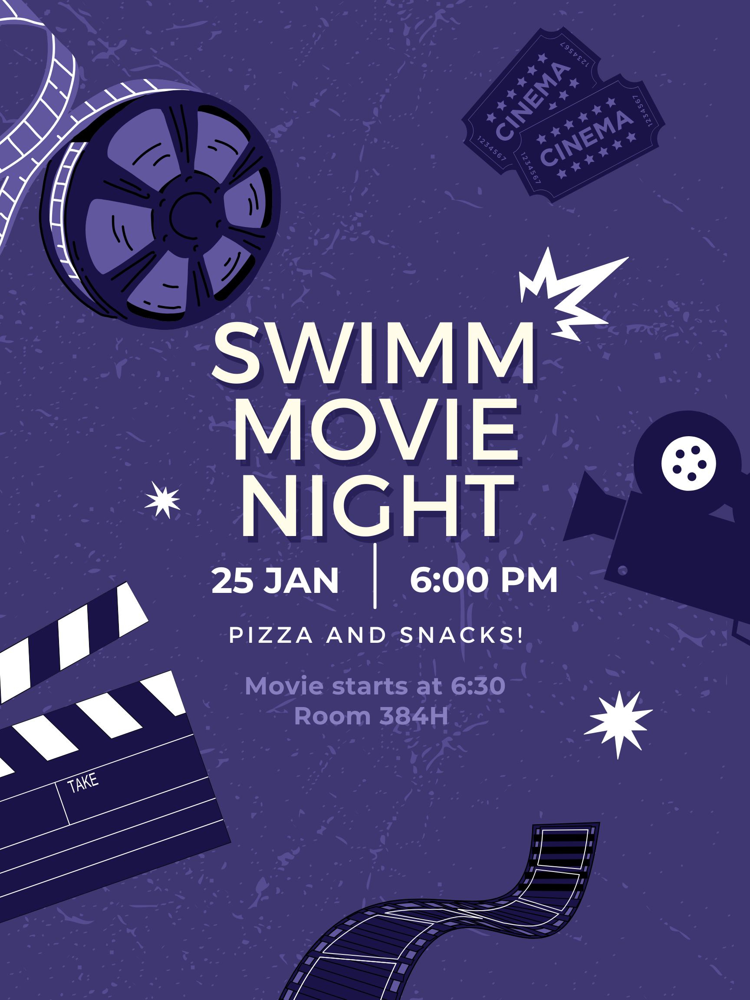
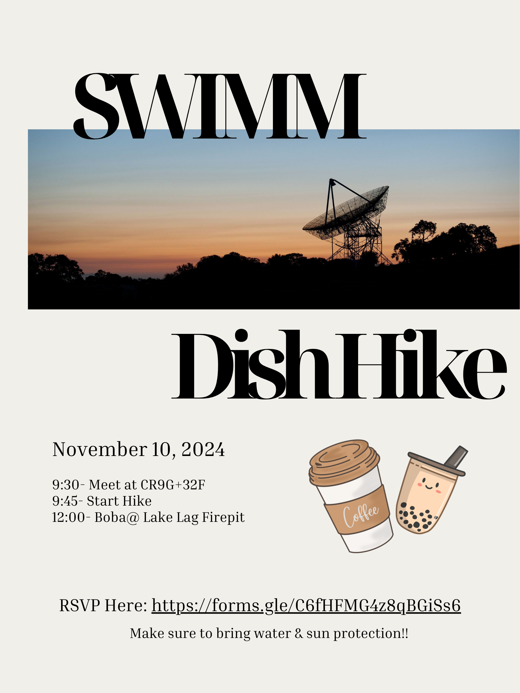
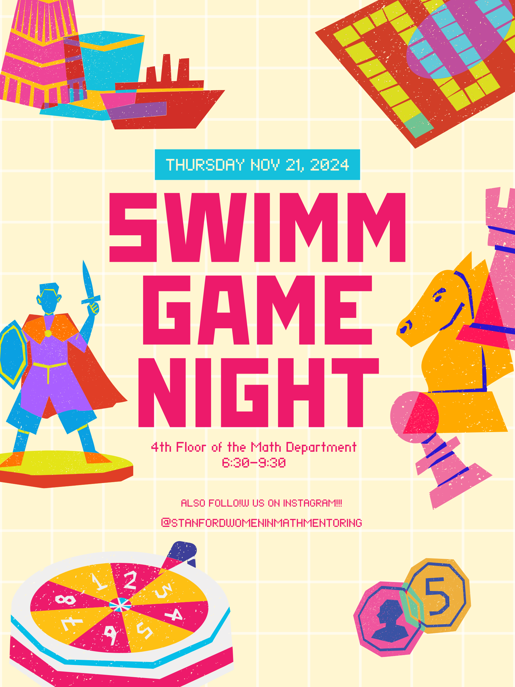

# Upcoming

Unless a date is specified below, the schedule is a estimated time range, and we will update here once the date has been settled.

A program wide event that has happened already is in italic. Events that's happening now or soon are in bold.

## Winter 2024
- Week 3:
  - Movie night. Just chill into the new quarter.
    > Saturday, Januarary 25th, 6:00pm, at 384H in the math department.
  - With pizza, snacks and non-alcoholic drinks.
  - 
  - Poster credit to Luisa Maria Boateng.

# Past Events

## Fall 2024
- Week 4 to 6:
  - Mentor-mentee meetings and introductions.
- Week 5 to 8:
  - Small group meals sponsored by SWIMM. Have fun!
- Week 6:
  - _SWIMM Social Dinner._ Let's meet :)
    > Friday November 1st, 6:30-8:00pm. Location and RSVP form in email lists.
- Week 7:
  - _SWIMM Dish Hiking._
    > Sunday, November 10th, 9:45am gathering for hiking. At noon, meet at Lake Lagunita fire pit for snacks.
  - With boba, coffee and snacks after the hike.
  - 
  - Poster credit to Luisa Maria Boateng.
    
- Week 9:
  - SWIMM _Game Night_ was chaotically fun!
    > Thursday, November 21st, 6:30-9:30pm, at the 4th floor lounge area in the math department.
  - With snacks and non-alcoholic drinks.
  - 
  - Poster credit to Luisa Maria Boateng.

View more of our past events [here](https://swimm.stanford.edu/events3.html).
