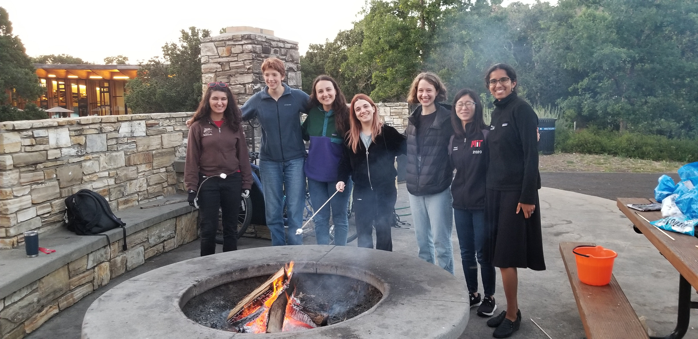
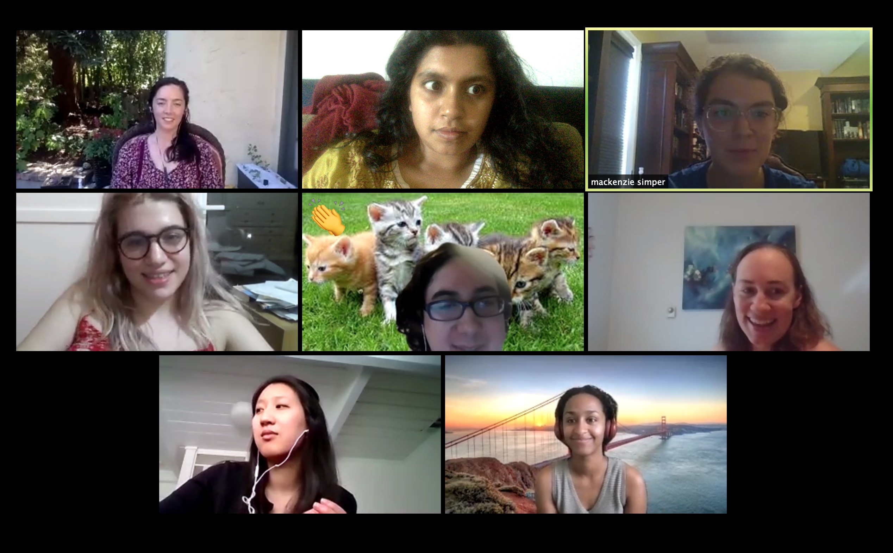
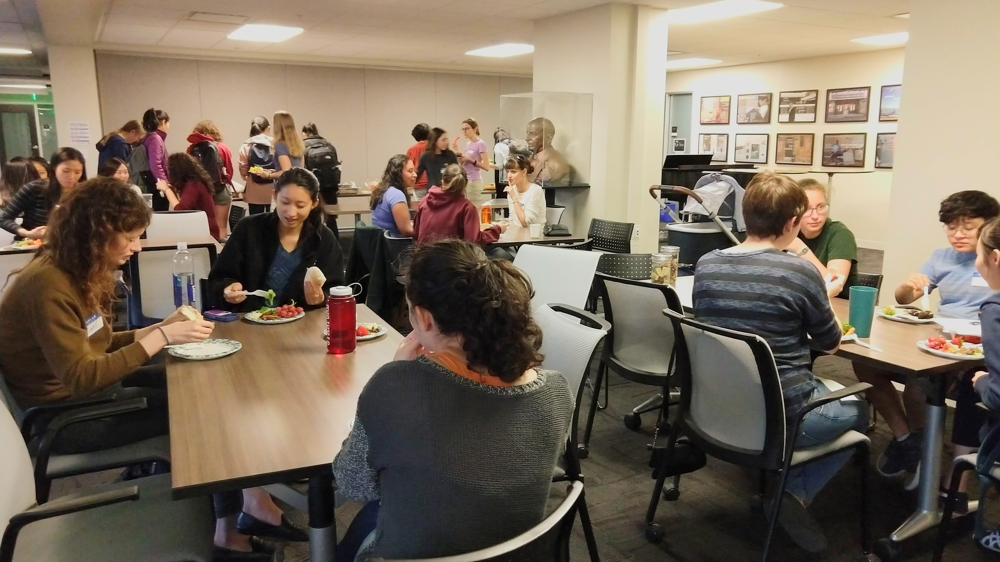

[comment]: <[Link to another page](./another-page.html).>

# What is SWIMM?

SWIMM is a mentoring program that aims to reduce the gender gap in mathematics. Undergraduates interested in math and computational science are paired with graduate student mentors from math, statistics, and ICME. We also host events, including study halls, dinners, and talks.

# Join SWIMM This Year
Application for 2024-2025 Academic Year will be open soon! We always welcome more people to the community events. Applications from those of all genders, identities, and backgrounds are welcome.

# Meet Our Past and Currents Participants and Mentors

> "I have found SWIMM to be helpful! The graduate students went through similar classes and experiences in the past few years and they have perspective that undergraduates do not."

> "I've had a wonderful time being a part of SWIMM. It's easy to have some male friends in the math department, but if not for this group, I would have missed out on getting to know a lot of women in math. It's better to have both!"

> "It is nice to have a member of the math community reach out to you, rather than the other way around. I think it is a great program!"

> "I think my self-confidence increased through the mentoring program. The interaction with the undergraduates lets me look back to when I was an undergraduate myself and it makes me realize how much I have mathematically grown since then. This feeling makes me much more confident and optimistic concerning a future career in academia in math."

> "This program has definitely helped me meet PhD students in the math department (I'm in ICME). I had never met a single Stanford Math PhD student before joining SWIMM, and now I know at least five of them by name."

> "At one of the program-wide dinners some of us expressed the impression that Stanford seems to have a lot of women in Math (undergrad and grad) and we were surprised to learn the actual percentages were much lower than we thought. This somehow made me feel like SWIMM has created a community where we see a lot of women and feel their presence in Math, which is great!"

> "My impression of mathematics at Stanford is still that it's very male-dominated. However, being part of SWIMM showed me that there is nevertheless a place in the field for women of color like me."

> "Taking the 60 series deterred me from math at Stanford, but listening to people in SWIMM talk about their experiences with the math department + how they persevered through helped me be confident about my decision to be a math major."

> "I have found SWIMM an amazing program and a great way to both get to know graduate students in the math department as well as a way to meet and connect with fellow female undergraduates interested in math, many of whom I did not previously have a chance to interact with. It's been really wonderful!"

> "Talking with my mentor has made math grad school seem less scary. She is very approachable and often experiences the same struggles that I do, while still kicking ass."

> "It was great to meet someone doing their PhD in a field related to math and think that maybe I would like to do something similar in the future. It's been really helpful to feel less alone and also to share experiences."

